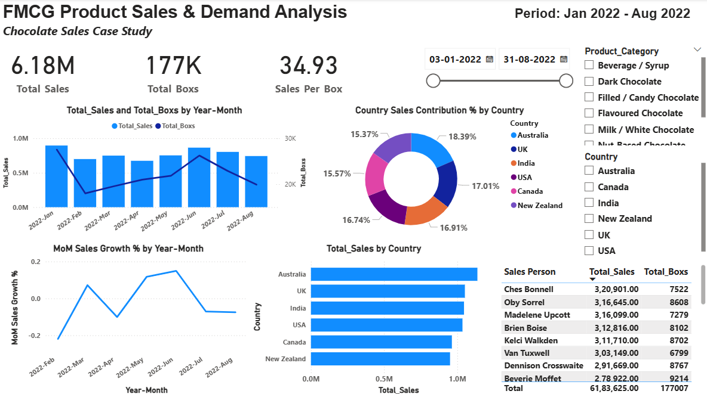
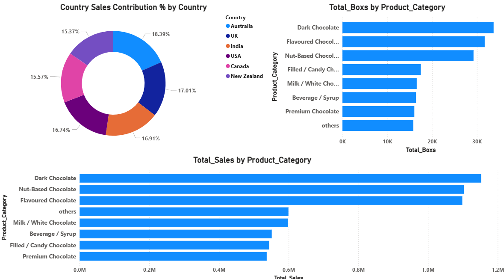

# 🍫 FMCG Chocolate Sales & Demand Analysis

## 📌 Project Overview
Power BI dashboard analyzing chocolate sales performance from **Jan 2022 – Aug 2022** focusing on:

- Revenue & boxes sold  
- Country wise contribution  
- Product category demand  
- Month-on-month growth  
- Sales person performance

## 📂 Dataset
- File: **Chocolate Sales.csv**
- Fields: sales, boxes, country, product category, salesperson, date

## 📊 Dashboard Preview

### Part 1

### Part 2

## 🔍 Key Metrics
- **Total Sales:** 6.18M  
- **Total Boxes:** 177K  
- **Sales per Box:** 34.93

## 📈 Insights
- UK & Australia are top revenue contributors  
- Dark Chocolate highest selling category  
- Sales peak in June 2022  
- Stable demand across months  
- Strong performance by top salespersons

## 🛠 Tools Used
- Power BI  
- Excel  
- Data Cleaning  
- DAX Measures  
- Data Visualization
